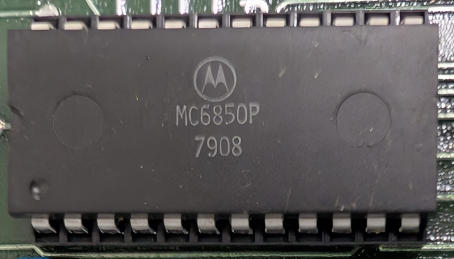

:orphan:

.. _MC6850P:

.. #Metadata {'Product':'MC6850P','Name':'Asynchronous Communications Interface Adapter','Storage': 'MEK6800D2'}

MC6850P Asynchronous Communications Interface Adapter
=====================================================

.. rubric:: Specific Information

.. csv-table:: 
   :widths: auto

   "Date Code","7908"
   "Manufacture Date","12-FEB-1979 to 18-FEB-1979"
   "Packaging","Plastic"
   "Status","Production"
   "Location","TBD"
   "Temperature","0-70\ :sup:`o`\ C"
   "Frequency","1MHz"
   "Notes",""

.. rubric:: Collection Information

.. csv-table:: 
   :header: "Acquired"
   :widths: auto

    |present| 9-SEP-2025

.. rubric:: Links

:download:`MC6850 Asynchronous Communications Interface Adapter (MC6850)  <../../../../_static/Documents/Datasheets/MC6850.pdf>`