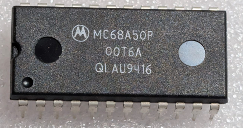

:orphan:

.. _MC68A50P:

MC68A50P Asynchronous Communications Interface Adapter (MC6850)
===============================================================

.. #Metadata {'Product':'MC68A50P','Storage': 'Storage Box 1', 'Drawer':4,'Row':1,'Column':4}

.. rubric:: Specific Information

.. csv-table:: 
   :widths: auto

   "Date Code","9416"
   "Manufacture Date","11-APR-1994 to 17-APR-1994"
   "Packaging","Plastic"
   "Status","Production"
   "Location","Drawer 4"
   "Temperature","0-70\ :sup:`o`\ C"
   "Frequency","1.5MHz"
   "Notes",""

.. rubric:: Collection Information

.. csv-table:: 
   :header: "Component","Datasheet"
   :widths: auto

   ":material-regular:`verified;2em;sd-text-success` 30-MAY-2025",":material-regular:`thumb_down;2em;sd-text-danger`"
