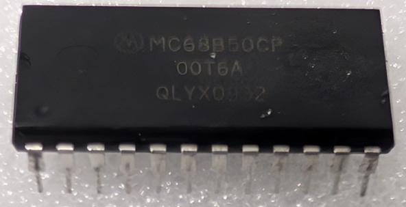

:orphan:

.. _MC68B50CP:
.. #Metadata {'Product':'MC68B50CP','Storage': 'Storage Box 1','Drawer':4,'Row':3,'Column':1}

MC68B50CP Asynchronous Communications Interface Adapter (MC6850)
================================================================

.. rubric:: Specific Information

.. csv-table:: 
   :widths: auto

   "Date Code","0932"
   "Manufacture Date","03-AUG-2009 to 09-AUG-2009"
   "Packaging","Plastic"
   "Status","Product"
   "Location","Drawer 2"
   "Temperature","-40-85\ :sup:`o`\ C"
   "Frequency","2 MHz"
   "Notes",""

This date code and manufacture dates should be scrutinised.

.. rubric:: Collection Information

.. csv-table:: 
   :header: "Component","Datasheet"
   :widths: auto

    :material-regular:`verified;2em;sd-text-success` 14-MAY-2025`,:material-regular:`verified;2em;sd-text-success` 28-MAR-2025
