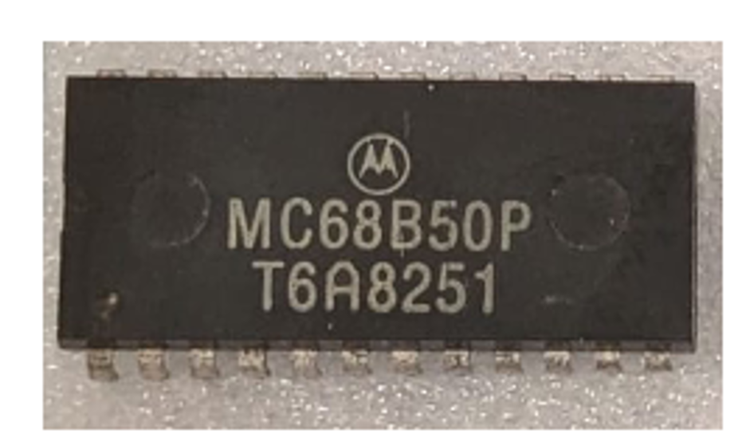

:orphan:

.. _MC68B50P:

.. #Metadata {'Product':'MC68B50P','Storage': 'Storage Box 1','Drawer':2,'Row':2,'Column':1}

MC68B50P Asynchronous Communications Interface Adapter
====================================================== 

.. rubric:: Specific Information

.. csv-table:: 
   :widths: auto

   "Date Code","8251"
   "Manufacture Date","13-DEC-1982 to 19-DEC-1982"
   "Packaging","Plastic"
   "Status","Production"
   "Location","Drawer 2"
   "Notes",""

.. rubric:: Collection Information

.. csv-table:: 
   :header: "Component","Datasheet"
   :widths: auto

   :material-regular:`verified;2em;sd-text-success` 12-MAR-2025,:material-regular:`verified;2em;sd-text-success` :ref:`28-MAR-2025 <MC6850>`

