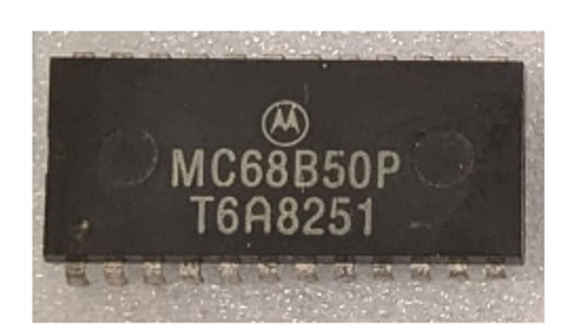

:orphan:

.. _MC68B50P:

.. #Metadata {'Product':'MC68B50P','Storage': 'Storage Box 1','Drawer':4,'Row':2,'Column':1}

MC68B50P Asynchronous Communications Interface Adapter (MC5850)
===============================================================

.. rubric:: Specific Information

.. csv-table:: 
   :widths: auto

   "Date Code","8251"
   "Manufacture Date","13-DEC-1982 to 19-DEC-1982"
   "Packaging","Plastic"
   "Status","Production"
   "Location",":ref:`Storage Box 1, Drawer 4, Row 2, Column 1 <Storage_Box_1_Drawer_4>`"
   "Notes",""

.. rubric:: Collection Information

.. csv-table:: 
   :header: "Acquired"
   :widths: auto

   |present| 12-MAR-2025

