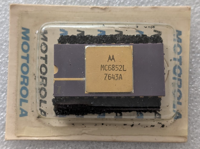
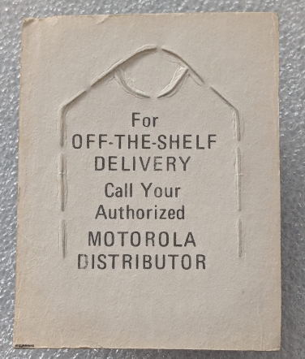

:orphan:

.. _MC6852L:

.. #TBD {'Product':'MC6852L','Storage': 'Storage Box 1','Drawer':4,'Row':2,'Column':4}

MC6852L Synchronous Serial Adapter (1 Mhz)
==========================================

Blister pack

Rear of packaging

.. rubric:: Specific Information

.. csv-table:: 
   :widths: auto

   "Date Code","7643"
   "Manufacture Date","18-OCT-1976 to 24-OCT-1976"
   "Packaging","Ceramic"
   "Status","Production"
   "Location","TBD"
   "Notes","New in box, unopened"

.. rubric:: Collection Information

.. csv-table:: 
   :header: "Component","Datasheet"
   :widths: auto

   :material-regular:`verified;2em;sd-text-success` 2-JUN-2025,:material-regular:`thumb_down;2em;sd-text-danger`

.. rubric:: Links

:download:`MC6852 Datasheet <../../../../_static/Documents/Datasheets/MC6852.pdf>`
