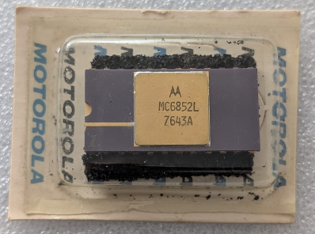
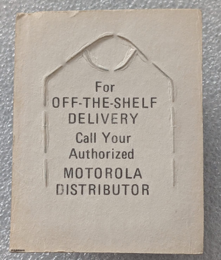

:orphan:

.. _MC6852L:

.. #Metadata {'Product':'MC6852L','Storage': 'Storage Box 2','Drawer':0,'Row':1,'Column':1}

MC6852L Synchronous Serial Adapter (1 Mhz)
==========================================

Blister pack

Rear of packaging

.. rubric:: Specific Information

.. csv-table:: 
   :widths: auto

   "Date Code","7643"
   "Manufacture Date","18-OCT-1976 to 24-OCT-1976"
   "Packaging","Ceramic"
   "Status","Production"
   "Location",":ref:`Storage Box 2, Drawer 0, Row 1, Column 1 <Storage_Box_2_Drawer_0>`"
   "Notes","New in box, unopened"

.. rubric:: Collection Information

.. csv-table:: 
   :header: "Acquired"
   :widths: auto

   |present| 02-JUN-2025

.. rubric:: Links

:download:`MC6852 Datasheet <../../../../_static/Documents/Datasheets/MC6852.pdf>`
