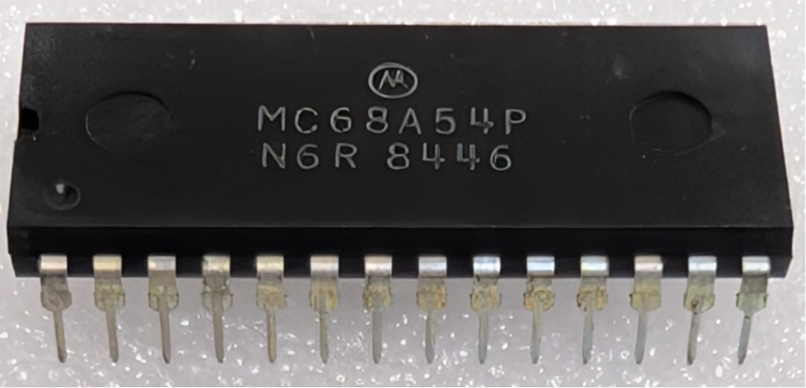

:orphan:

.. _MC68A54P:

.. #Metadata {'Product':'MC68A54P','Storage': 'Storage Box 2','Drawer':1,'Row':1,'Column':3}

MC68A54P Advanced Data-Link Controller (ADLC)
=============================================

.. rubric:: Specific Information

.. csv-table:: 
   :widths: auto

   "Date Code","8446"
   "Manufacture Date","05-NOV-1984 to 11-NOV-1984"
   "Packaging","Plastic"
   "Status","Production"
   "Location",":ref:`Storage Box 2, Drawer 1, Row 1, Column 3 <Storage_Box_2_Drawer_1>`"
   "Temperature","0-70\ :sup:`o`\ C"
   "Frequency","1.5 Mhz"
   "Notes",""

.. rubric:: Collection Information

.. csv-table:: 
   :header: "Acquired"
   :widths: auto

   |present| 05-OCT-2025
   
.. rubric:: Links

:download:`MC6854 Advanced Data-Link Controller (ADLC)  <../../../../_static/Documents/Datasheets/MC6854.pdf>`
