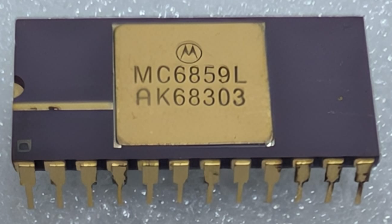

:orphan:

.. _MC6859L:

.. #Metadata {'Product':'MC6859L','Name':'MC6859L Data Security Device','Storage': 'Storage Box 2','Drawer':4,'Row':1,'Column':1}

MC6859L Data Security Device
============================

.. rubric:: Specific Information

.. csv-table:: 
   :widths: auto

   "Date Code","8303"
   "Manufacture Date","10-JAN-1983 to 16-JAN-1983"
   "Packaging","Ceramic"
   "Status","TBD"
   "Location",":ref:`Storage Box 2, Drawer 4, Row 1, Column 1 <Storage_Box_2_Drawer_4>`"
   "Temperature","-40-85\ :sup:`o`\ C"
   "Mask","AK6"
   "Frequency","1.5 Mhz"
   "Notes",""

.. rubric:: Collection Information

.. csv-table:: 
   :header: "Component"
   :widths: auto

   |present| 27-OCT-2025

.. rubric:: Links

:download:`MC6859 Data Security Device  <../../../../_static/Documents/Datasheets/MC6859.pdf>`
