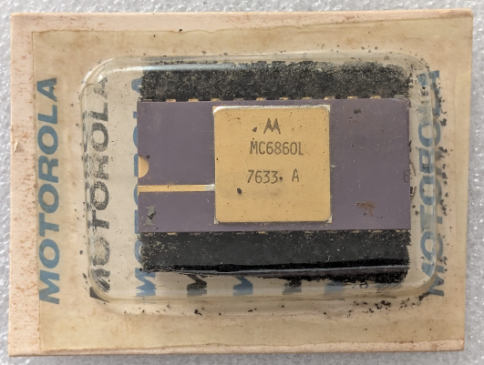

:orphan:

.. _MC6860L:

.. #NOTE {'Product':'MC6860L','Storage': 'Storage Box 1','Drawer':4,'Row':3,'Column':3}

MC6860L 0-600 bps Digital Modem
===============================

.. rubric:: Specific Information

.. csv-table:: 
   :widths: auto

   "Date Code","7633"
   "Manufacture Date","09-AUG-1976 to 15-AUG-1976"
   "Packaging","Ceramic"
   "Status","Production"
   "Location","Drawer 4"
   "Notes","New in box, unopened"

.. rubric:: Collection Information

.. csv-table:: 
   :header: "Component","Datasheet"
   :widths: auto

   ":material-regular:`verified;2em;sd-text-success` 2-JUN-2025",":material-regular:`thumb_down;2em;sd-text-danger`"

.. rubric:: Links

:download:`MC6860 Datasheet <../../../../_static/Documents/Datasheets/MC6860.pdf>`

:download:`MC6860L Advance Information Datasheet <../../../../_static/Documents/Datasheets/MC6860L.1.pdf>`
