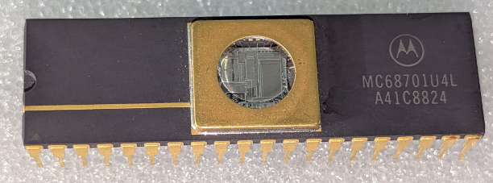

:orphan:

.. _MC68701U4L-1:

.. #None {'Product':'MC68701U4L-1','Storage': 'Storage Box X','Drawer':Y,'Row':X,'Column':S}

MC68701U4L-1 Microprocessor Unit with 8-bit EPROM
=================================================

.. rubric:: Specific Information

.. csv-table:: 
   :widths: auto

   "Date Code","TBD"
   "Manufacture Date","TBD"
   "Packaging","Ceramic"
   "Status","Production"
   "Location","TBD"
   "Notes",""
   "Frequency","1 MHz"
   "Temperature","0-70\ :sup:`o`\ C"
   
.. rubric:: Collection Information

.. csv-table:: 
   :header: "Acquired"
   :widths: auto

   "|intransit| "

.. rubric:: Links

:download:`MC68701U4L 8-bit EPROM Microcomputer Unit <../../../../_static/Documents/Datasheets/MC68701U4.pdf>`