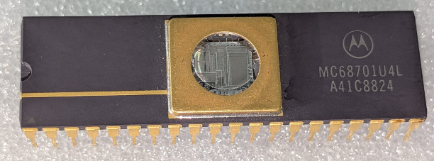

:orphan:

.. _MC68701U4L:

.. #Metadata {'Product':'MC68701U4L','Storage': 'Storage Box 1','Drawer':3,'Row':2,'Column':1}

MC68701U4L Microprocessor Unit with 8-bit EPROM
================================================

.. rubric:: Specific Information

.. csv-table:: 
   :widths: auto

   "Date Code","8824"
   "Manufacture Date","06-JUN-1988 to 12-JUN-1988"
   "Packaging","Ceramic"
   "Status","Production"
   "Location","TBD"
   "Notes",""
   "Frequency","1 MHz"
   "Temperature","0-70\ :sup:`o`\ C"
   
.. rubric:: Collection Information

.. csv-table:: 
   :header: "Component","Datasheet"
   :widths: auto

   ":material-regular:`verified;2em;sd-text-success` 21-MAY-2025",":material-regular:`thumb_down;2em;sd-text-danger`"

.. rubric:: Links

:download:`MC68701U4L 8-bit EPROM Microcomputer Unit <../../../../_static/Documents/Datasheets/MC68701U4.pdf>`