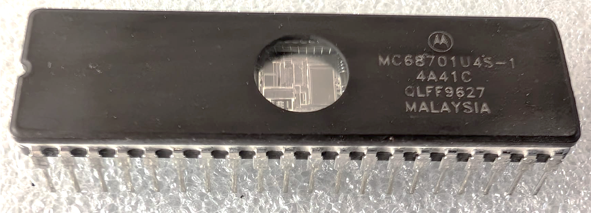

:orphan:

.. _MC68701U4S1:

MC68701U4S-1 Microprocessor Unit with 8-bit EPROM
=================================================

.. #Metadata {'Product':'MC68701U4S1','Storage': 'Storage Box 1','Drawer':2,'Row':3,'Column':1}

.. rubric:: Specific Information

.. csv-table:: 
   :widths: auto

   "Date Code","9627"
   "Manufacture Date","24-JUN-1996 to 30-JUN-1996"
   "Packaging","CERDIP"
   "Status","Production"
   "Location",":ref:`Storage Box 1, Drawer 2, Row 3, Column 1 <Storage_Box_1_Drawer_2>`"
   "Notes",""
   "Frequency","1.25 MHz"
   "Temperature","-40-85\ :sup:`o`\ C"
   
.. rubric:: Collection Information

.. csv-table:: 
   :header: "Acquired"
   :widths: auto

   :material-regular:`verified;2em;sd-text-success` 5-JUL-2025

.. rubric:: Links

:download:`MC68701U4 8-bit EPROM Microcomputer Unit <../../../../_static/Documents/Datasheets/MC68701U4.pdf>`