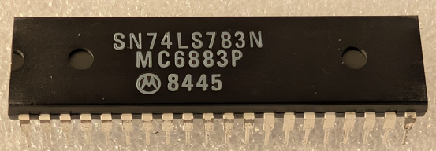

:orphan:

.. _MC6883P:

MC6883P Synchronous Address Multiplexer
=======================================

.. #Metadata {'Product':'MC6883P','Storage': 'Storage Box 1','Drawer':3,'Row':2,'Column':2}

.. rubric:: Specific Information

.. csv-table:: 
   :widths: auto

   "Date Code","8338"
   "Manufacture Date","12-SEP-1983 to 18-SEP-1983"
   "Packaging","Plastic"
   "Status","Production"
   "Location","Drawer 3"
   "Temperature","N/A"
   "Frequency","N/A"
   "Notes",""

.. rubric:: Collection Information

.. csv-table:: 
   :header: "Acquired"
   :widths: auto

   :material-regular:`verified;2em;sd-text-success` 5-JUL-2025

