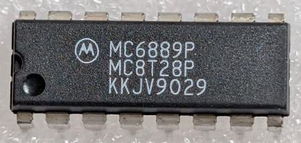

:orphan:

.. _MC6889P:
.. #Metadata {'Product':'MC6889P','Storage': 'Storage Box 1','Drawer':4,'Row':1,'Column':5}

MC6889P Quad Bus Transceiver (Non-Inverting)
============================================

.. rubric:: Specific Information

.. csv-table:: 
   :widths: auto

   "Date Code","9029"
   "Manufacture Date","09-JUL-1990 to 15-JUL-1990"
   "Packaging","Plastic"
   "Status","Production"
   "Location",":ref:`Storage Box 1, Drawer 4, Row 1, Column 5 <Storage_Box_1_Drawer_4>`"
   "Notes",""

.. rubric:: Collection Information

.. csv-table:: 
   :header: "Acquired"
   :widths: auto

    |present| 30-MAY-2025

.. rubric:: Links

:download:`MC6889 NonInverting Quad Three-State Bus Transceiver  <../../../../_static/Documents/Datasheets/MC6889.pdf>`
