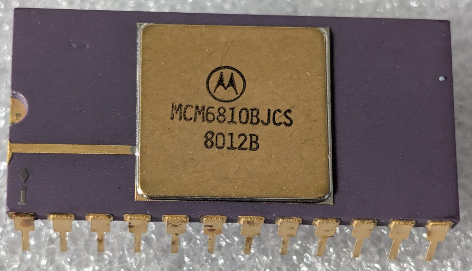

:orphan:

.. _MCM6810BJCS:

.. #Metadata {'Product':'MCM6810BJCS','Storage': 'Storage Box 1','Drawer':4,'Row':3,'Column':4}

MCM6810BJCS 128 x 8-Bit Static Random Access Memory (MCM6810)
=============================================================

.. rubric:: Specific Information

.. csv-table:: 
   :widths: auto

   "Date Code","8012"
   "Manufacture Date","17-MAR-1980 to 23-MAR-1980"
   "Packaging","MIL-STD-883B"
   "Status","Production"
   "Location",":ref:`Storage Box 1, Drawer 4, Row 3, Column 4 <Storage_Box_1_Drawer_4>`"
   "Temperature","-55-125\ :sup:`o`\ C"
   "Frequency","1MHz"
   "Notes",""

.. rubric:: Collection Information

.. csv-table:: 
   :header: "Component"
   :widths: auto

   |present| 4-SEP-2025

.. rubric:: Links

:download:`MC6810 DataSheet <../../../../_static/Documents/Datasheets/MCM6810.pdf>`

:download:`MC6810 DataSheet (1981 edition) <../../../../_static/Documents/Datasheets/MCM6810.2.pdf>`