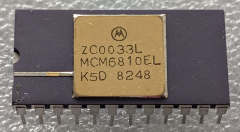

:orphan:

.. _MCM6810EL:

.. #Metadata {'Product':'MCM6810EL','Storage': 'Storage Box 1','Drawer':4,'Row':1,'Column':3}

MCM6810EL 128 x 8-bit RAM
=========================

.. rubric:: Specific Information

.. csv-table:: 
   :widths: auto

   "Date Code","8248"
   "Manufacture Date","22-NOV-1982 to 28-NOV-1982"
   "Packaging","Ceramic"
   "Status","Production"
   "Location",":ref:`Storage Box 1, Drawer 4, Row 1, Column 3 <Storage_Box_1_Drawer_4>`"
   "Frequency","TBD"
   "Temperature","TBD"
   "Notes",""

.. rubric:: Collection Information

.. csv-table:: 
   :header: "Acquired"
   :widths: auto

   ":material-regular:`verified;2em;sd-text-success` 29-APR-2025"

.. rubric:: Links

:download:`MC6810 DataSheet <../../../../_static/Documents/Datasheets/MCM6810.pdf>`

