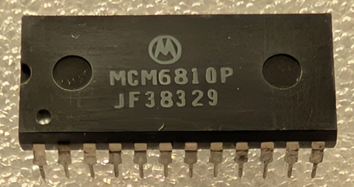

:orphan:

.. _MCM6810P:

.. #Metadata {'Product':'MCM6810P','Storage': 'Storage Box 1','Drawer':4,'Row':3,'Column':2}

MCM6810P 128 x 8-bit RAM
========================

.. rubric:: Specific Information

.. csv-table:: 
   :widths: auto

   "Date Code","8329"
   "Manufacture Date","11-JUL-1983 to 17-JUL-1983"
   "Packaging","Plastic"
   "Status","Production"
   "Location",":ref:`Storage Box 1, Drawer 4, Row 3, Column 2 <Storage_Box_1_Drawer_4>`"
   "Temperature","0-70\ :sup:`o`\ C"
   "Notes",""

.. rubric:: Collection Information

.. csv-table:: 
   :header: "Acquired"
   :widths: auto

   ":material-regular:`verified;2em;sd-text-success` 12-MAR-2025"

.. rubric:: Links

:download:`MC6810 DataSheet <../../../../_static/Documents/Datasheets/MCM6810.pdf>`

:download:`MC6810 DataSheet (1981 edition) <../../../../_static/Documents/Datasheets/MCM6810.2.pdf>`