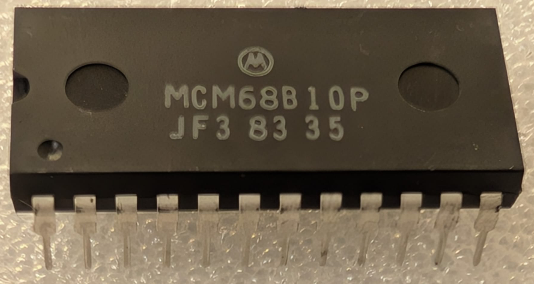

:orphan:

.. _MCM68B10P:

.. #Metadata {'Product':'MCM68B10P','Storage': 'Storage Box 1','Drawer':4,'Row':2,'Column':3}

MCM68B10P 128 x 8-bit RAM
=========================

.. rubric:: Specific Information

.. csv-table:: 
   :widths: auto

   "Date Code","8335"
   "Manufacture Date","22-AUG-1983 to 28-AUG-1983"
   "Packaging","Plastic"
   "Status","Production"
   "Location","Drawer 2"
   "Notes",""
   "Frequency","1.5MHz"
   "Temperature","0-70\ :sup:`o`\ C"

.. rubric:: Collection Information

.. csv-table:: 
   :header: "Component","DataSheet"
   :widths: auto

   ":material-regular:`verified;2em;sd-text-success` 8-MAY-2025",":material-regular:`thumb_down;2em;sd-text-danger`"

.. rubric:: Links

:download:`MC6810 DataSheet <../../../../_static/Documents/Datasheets/MCM6810.pdf>`

