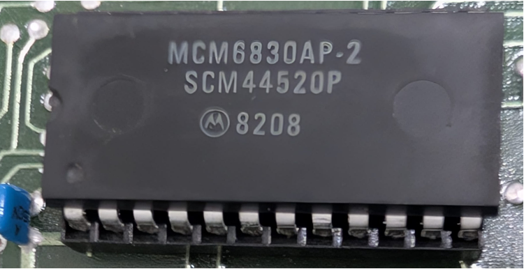

:orphan:

.. _MCM6830AP-2:

MCM6830AP-2 1024 x 8-bit ROM 
============================

.. #Metadata {'Product':'MCM6830AP-2','Name':'1024 x 8-bit ROM containing JBUG', 'Storage': 'MEK6800D2'}

.. rubric:: Specific Information

.. csv-table:: 
   :widths: auto

   "Date Code","8208"
   "Manufacture Date","15-FEB-1982 to 21-FEB-1982"
   "Packaging","Plastic"
   "Status","Production"
   "Location",":ref:`Storage Box 1, Drawer 4, Row 2, Column 4 <Storage_Box_1_Drawer_4>`"
   "Frequency","1.0-70Mhz"
   "Temperature","-0-70\ :sup:`o`\ C"
   "Notes","The content has not yet been verified, but the numbering scheme suggests it is MIKBUG/MINIBUG but in a faster-clocked chip"

.. rubric:: Without dumping the ROM, there is no reliable way to determine which version of JBUG is contained therein.

.. rubric:: Collection Information

.. csv-table:: 
   :header: "Acquired"
   :widths: auto

   ":material-regular:`verified;2em;sd-text-success` 09-SEP-2025"

.. rubric:: Links

:ref:`JBUG Monitor V1.8 <JBUG_1_8>`

