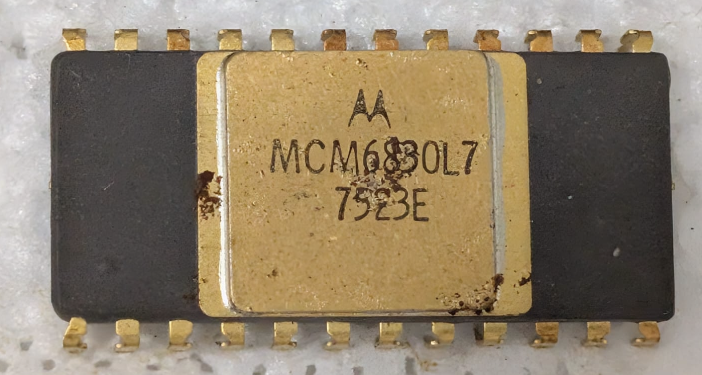

:orphan:

.. _MCM6830L7:

MCM6830L7 1024 x 8-bit ROM containing MIKBUG/MINIBUG
====================================================

.. #Metadata {'Product':'MCM6830L7','Name':'1024 x 8-bit ROM containing MIKBUG/MINIBUG','Storage': 'Briefcase'}

.. rubric:: Specific Information

.. csv-table:: 
   :widths: auto

   "Date Code","7523"
   "Manufacture Date","02-JUN-1975 to 08-JUN-1975"
   "Packaging","Ceramic"
   "Status","Production"
   "Location","Briefcase"
   "Notes",""

This is a standard MCM6830 which came pre-programmed with MIKBUG/MINIBUG.

.. rubric:: Collection Information

.. csv-table:: 
   :header: "Component","DataSheet"
   :widths: auto

   ":material-regular:`verified;2em;sd-text-success` 30-JAN-2025",":material-regular:`thumb_down;2em;sd-text-danger`"

.. rubric:: Links

:ref:`MC6830L7 Engineering Note EN-100 <EN-100>`

