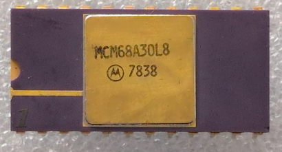

:orphan:

.. _MCM68A30L8:

MCM68A30L8 1024 x 8-bit ROM 
===========================

.. #Metadata {'Product':'MCM68A30L8','Name':'1024 x 8-bit ROM containing MIKBUG/MINIBUG', 'Storage': 'Storage Box 1','Drawer':4,'Row':1,'Column':6}

.. rubric:: Specific Information

.. csv-table:: 
   :widths: auto

   "Date Code","7838"
   "Manufacture Date","11-SEP-1978 to 17-SEP-1978"
   "Packaging","Ceramic"
   "Status","Production"
   "Location","Drawer 4"
   "Frequency","1.5Mhz"
   "Temperature","-40-85\ :sup:`o`\ C"
   "Notes","The content has not yet been verified, but the numbering scheme suggests it is MIKBUG/MINIBUG but in a faster-clocked chip"

.. rubric:: To be mounted

.. rubric:: Collection Information

.. csv-table:: 
   :header: "Component","DataSheet"
   :widths: auto

   ":material-regular:`verified;2em;sd-text-success` 31-MAY-2025",":material-regular:`thumb_down;2em;sd-text-danger`"

.. rubric:: Links

:ref:`MC6830L7 Engineering Note EN-100 <EN-100>`

