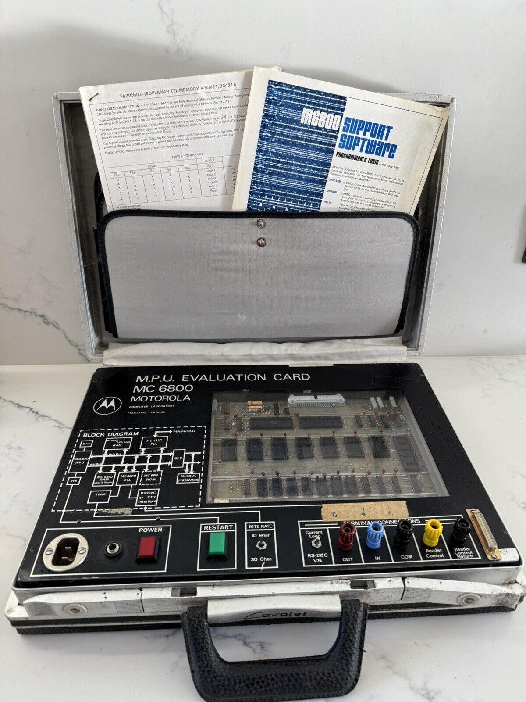
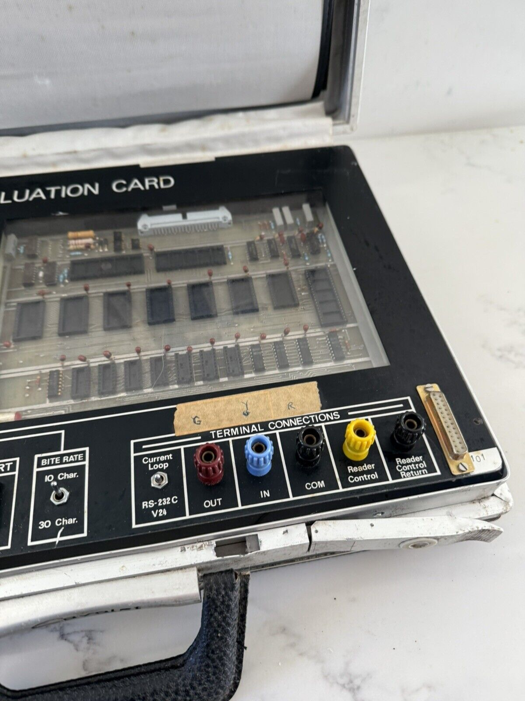
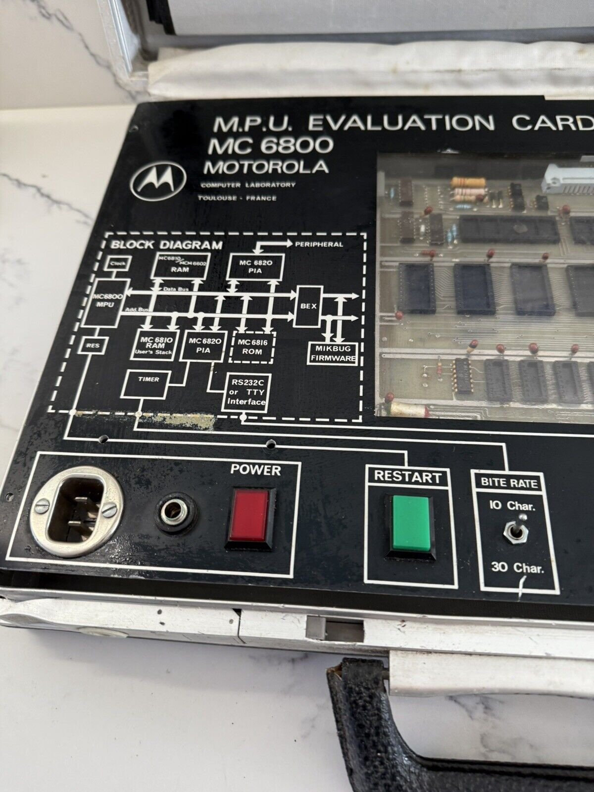
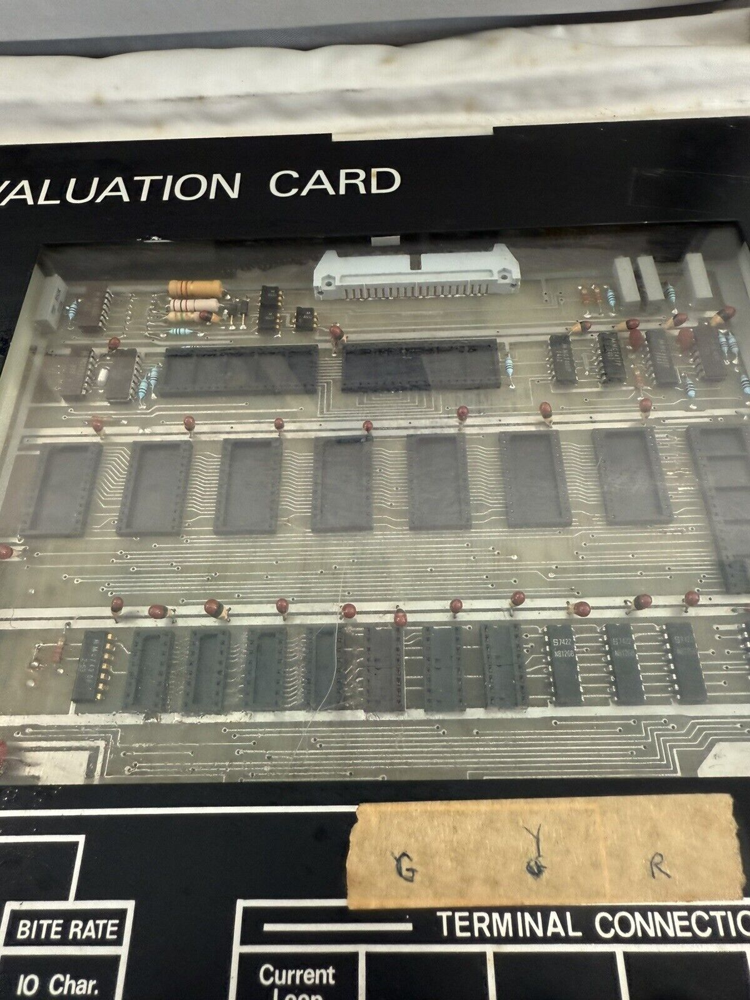
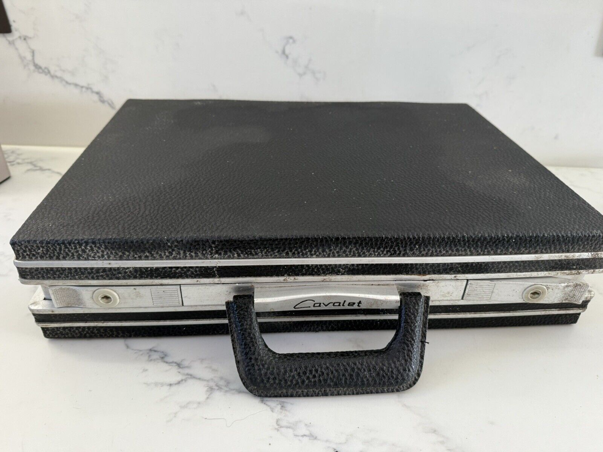

:orphan:

.. _HW-OTHER-NONE-2:

MPU Evalution Card MC6800 Microprocessor Board     
==============================================

.. Note:: 
    The briefcase-mounted evaluation system was acquired with several other documents.

   - :ref:`Users Guide for the Motorola Microcomputer Evaluation System <MES6800>`
   - :ref:`Motorola Software for General Electric <M-GE>`

.. rubric:: Collection Information

.. csv-table:: 
   :header: "Acquired"
   :widths: auto

    :material-regular:`verified;2em;sd-text-success` 30-JAN-2025,":material-regular:`thumb_down;2em;sd-text-danger`"