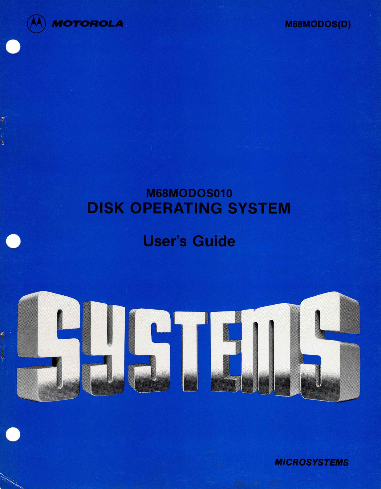

:orphan:

.. _M68MODOS(D):

.. #Metadata {'Product':'M68MODOS(D)','Name':'M68MODOS010 Disk Operating System Users Guide','Folder': 'None'}

M68MODOS010 Disk Operating System Users Guide
==============================================

.. rubric:: Collection Information

.. csv-table:: 
   :header: "Acquired"
   :widths: auto

   |notpresent|
   
.. rubric:: Links

:download:`M68MODOS010 Disk Operating System Users Guide <../../_static/Documents/Manuals/M68MODOS_D_Disk_Operating_System_Users_Guide_Version_3.0_197811.pdf>`