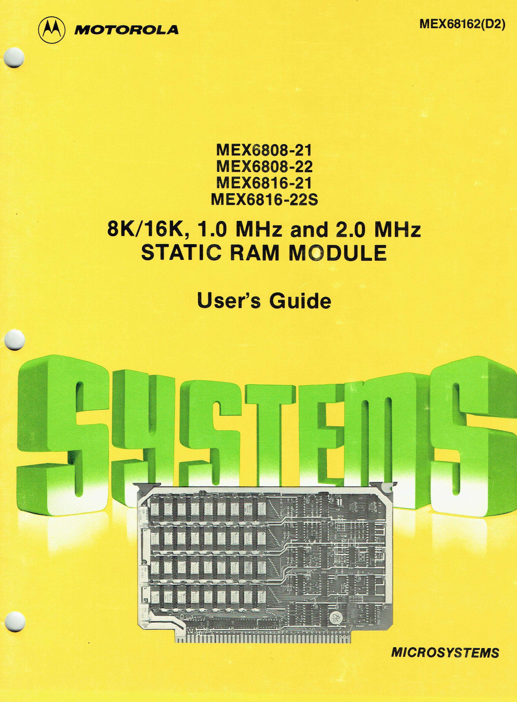

:orphan:

.. _MEX68162(D2):

.. #Metadata {'Product':'MEX68162(D2)','Name':'8K/16K, 1.0Mhz and 2.0MHz Static RAM Module Users Guide','Folder': 'None'}

8K/16K, 1.0Mhz and 2.0MHz Static RAM Module Users Guide
=======================================================

.. rubric:: Collection Information

.. csv-table:: 
   :header: "Acquired"
   :widths: auto

   |intransit|
   
.. rubric:: Links

:download:`8K/16K, 1.0Mhz and 2.0MHz Static RAM Module Users Guide <../../_static/Documents/Manuals/MEX68162_8K_16K_Static_RAM_Module_197812.pdf>`