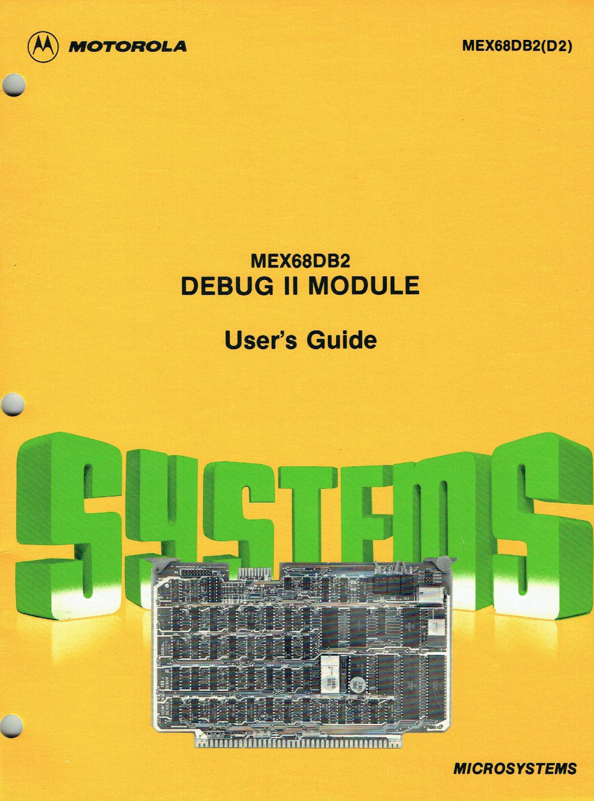

:orphan:

.. _MEX68DB2(D2):

.. #Metadata {'Product':'MEX68DB2(D2)','Name':'MEX68DB2 DEBUG II Module Users Guide','Folder': 'None'}

MEX68DB2 DEBUG II Module Users Guide
====================================

.. rubric:: Collection Information

.. csv-table:: 
   :header: "Acquired"
   :widths: auto

   |notpresent|
   
.. rubric:: Links

:download:`MEX68DB2 DEBUG II Module Users Guide <../../_static/Documents/Manuals/MEX68DB2_DEBUG_II_MOTOROLA_197903.pdf>`