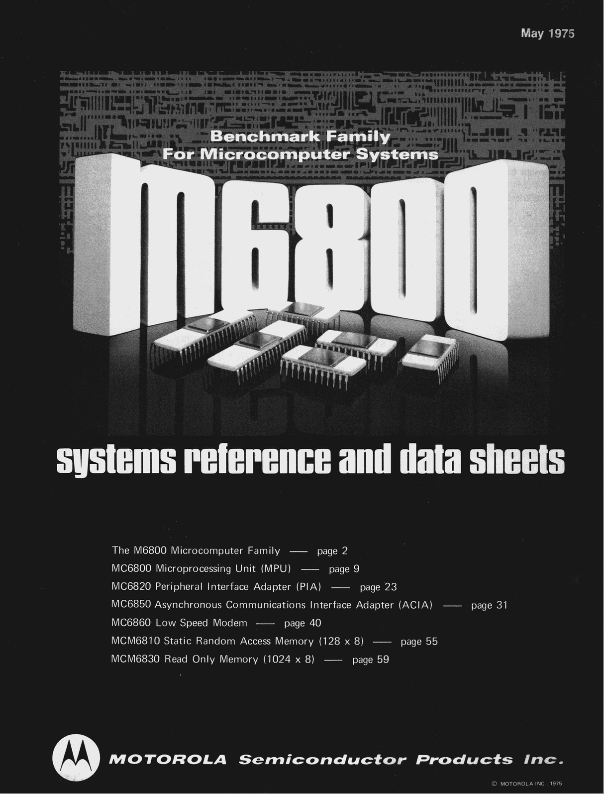

:orphan:

.. _SYSREF:

.. #Metadata {'Product':'M6800 Systems Reference and Data Sheets','Folder': 'Microprocessor Course'}

M6800 Systems Reference and Data Sheets
=======================================

.. note::

   This document was acquired (and will be stored) with the M6800 Microproessor Course Binder

   The datasheets contained within this document are:

   - :download:`MC6800 Microprocessing Unit (MPU) May 1975 Advance Information <../../_static/Documents/Datasheets/MC6800-May75.pdf>`

   - :download:`MC6820 Peripheral Interface Adapter (PIA) May 1975 Advance Information <../../_static/Documents/Datasheets/MC6800-May75.pdf>`

   - :download:`MC6850 Asynchronous Communications Interface Adapter (ACIA) May 1975 Advance Information <../../_static/Documents/Datasheets/MC6850-May75.pdf>`  

   - :download:`MC6860 Low Speed Modem May 1975 Advance Information <../../_static/Documents/Datasheets/MC6860-May75.pdf>`
   
   - :download:`MCM6810 Static Random Access Memory (128 x 8) May 1975 Advance Information <../../_static/Documents/Datasheets/MCM6810-May75.pdf>`

   - :download:`MCM6830 Read Only Memory (1024 x 8) May 1975 Advance Information <../../_static/Documents/Datasheets/MCM6830-May75.pdf>`

.. rubric:: Collection Information

.. csv-table:: 
   :header: "Acquired"
   :widths: auto

   |present| 31-MAR-2025

.. rubric:: Links

:download:`M6800 Systems Reference and Data Sheets (May 1975 Edition)<../../_static/Documents/Reference/M6800SystemsReferenceDataSheets_May75.pdf>`

:ref:`Microprocessor Course Binder <MC6800CRSBNDR>`