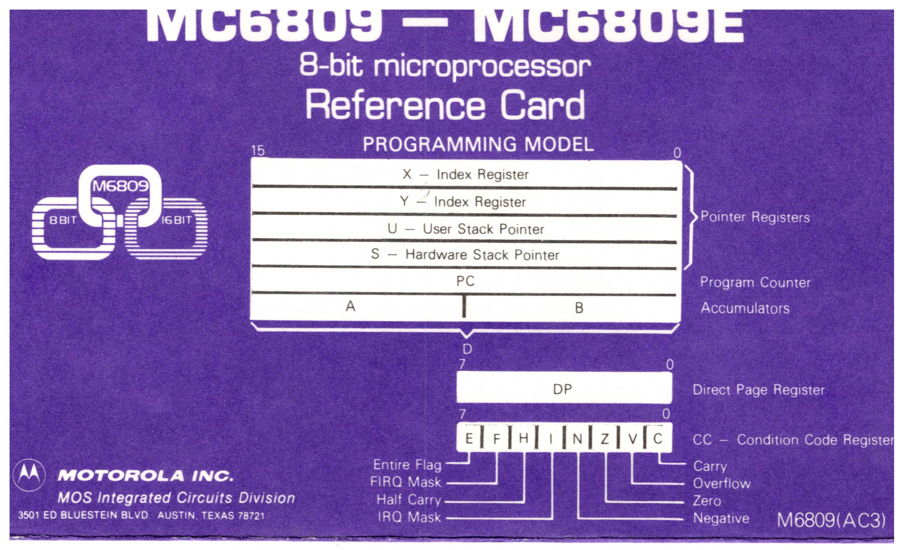

:orphan:

.. _REF-MC6809-MC6809E-1:

.. #Metadata {'Product':'MC6809/MC6809E 8-Bit Microprocessor Programming Model','Folder': '1'}

MC6809 – MC6809E 8-Bit Microprocessor Reference Card Programming Model - M6809(AC3)
===================================================================================

.. rubric:: Collection Information

.. csv-table:: 
   :header: "Acquired"
   :widths: auto

    ":material-regular:`verified;2em;sd-text-success` 19-MAR-2025"

.. rubric:: Links

:download:`MC6809 – MC6809E 8-Bit Microprocessor Reference Card Programming Model <../../_static/Documents/ReferenceCards/M6809(AC3).pdf>`

