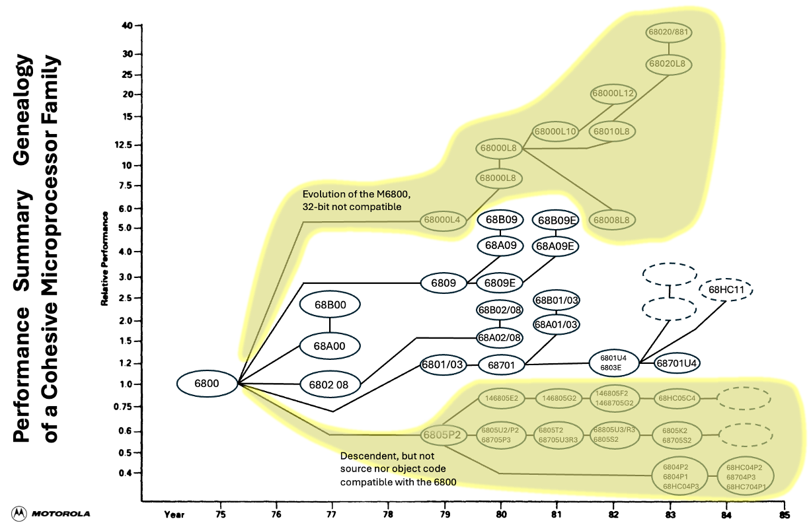
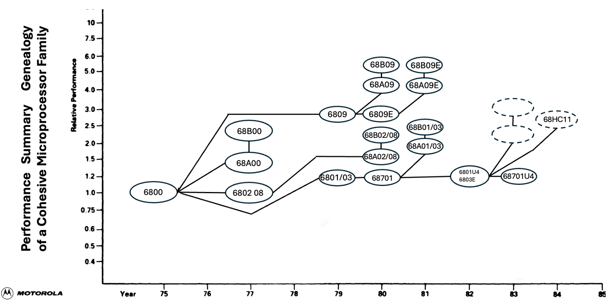

:orphan:

.. _scope page:

Scope of the Collection
=======================

The Motorola 6800 is an 8-bit microprocessor monolithic integrated circuit family introduced in 1974.
The original 6800 requires a +5 V supply only (generating bias voltages on chip) and came initially in 40-pin DIL packages. The 6800 has non-multiplexed data (8 bit) and address (16 bit) buses, and requires an external non-overlapping two-phase 0.1 − 1 MHz clock (later versions from 1976 on up to 2 MHz).

The 6802, introduced in 1977, includes 128 bytes RAM and an internal clock oscillator. The 6808 is the same without RAM.

The 68HC11, introduced in 1984, is an upward-compatible microcontroller that adds a second index register, 8x8 multiply and 16/16 divide instructions, as well as a range of 16-bit instructions that treat A and B as a combined 16-bit accumulator. On-chip peripherals include timers, parallel ports, A/D, SPI and UART.

A descendant of the original 6800, the 68000 is a 32-bit descendant. It has no backward compatibility, and is not natively able to execute 680x or 680x0 or 868HCxx code.

The families of processors are depicted in the two images below:

.. rubric:: Evolution of the 6800 Architecture

.. rubric:: Evolution of the 6800 Architecture showing only elements of interest

Integrated Circuits
-------------------

The ICs of interest are those which are 6800-compatible (or their immediate code-compatible descendants) together with their support ICs.
This includes:

- MC6800 and timing variants
- MC6801 and timing variants
- MC6802 and timing variants
- MC6803 and timing variants
- MC6809 and timing variants

There are many different iterations of these ICs (from engineering samples through to different packaging variants and temperature variants).

Additionally, any and all ICs which were constructed by Motorola to support the above ICs

Supporting Products
-------------------

Typically, the supporting products were the EXORciser system, its variants and supporting products.

This includes:

- Exorciser
- Storage
- Terminals
- Printers
- Additional expansion boards

Supporting Literature
---------------------

Most products contained (and were available separately) supporting literature, for exmaple:

- Programming Manuals
- Reference Manuals
- Reference Cards
- Training Materials

Datasheets
----------

Any and all datasheets for all products so far mentioned, including:

- Preliminary/Advance information
- Standard
- non-English language versions

Software
--------

Motorola marketed (and in some cases, included or gave away software) for the 6800 family of processors and supporting tools:

This includes

- Monitors
- Debuggers
- Editors
- Assemblers
- Language compilers

Second-Sourcing
--------------- 

Currently, products produced by second-source manufacturers are not included, due to their proliferation in the marketplace. If, however a Motorola-produced product is deemed extremely rare, expensive or impossible to find, then a second-source version will be considered. This will be highlighted where applicable.
