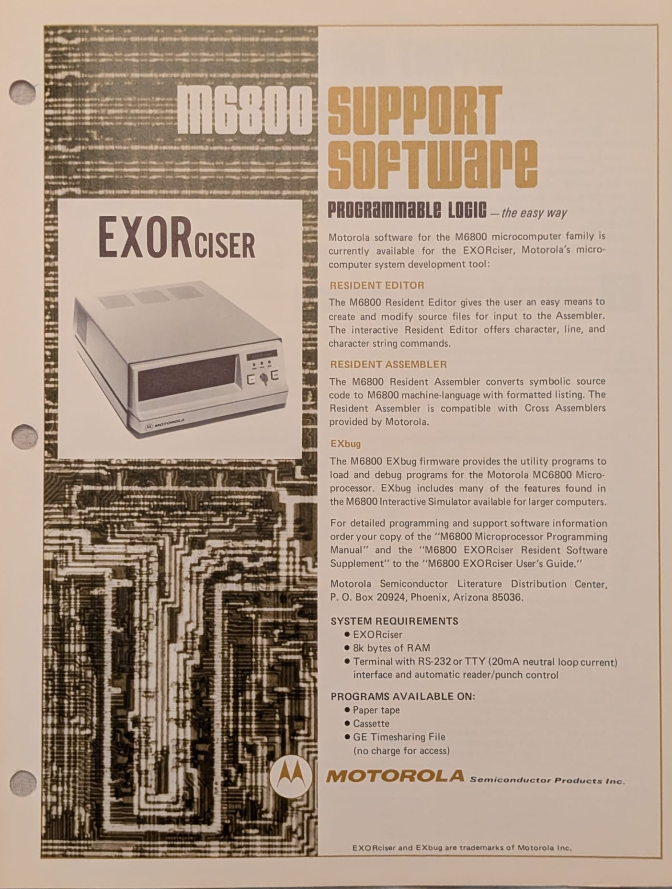

:orphan:

.. _M_EXORcser:

Motorola Software for Exorciser InfoSheet
=========================================

.. #Metadata {'Product':'Motorola Software for Exorciser InfoSheet','Folder': 'Microprocessor Course'}

.. rubric:: Notes

This Infosheet details the following products (all of which have their own individual manuals)

- :ref:`M6800 Co-Resident Editor Reference Manual <M68CRE(D)>` 
- :ref:`M6800 Co-Resident Assembler Reference Manual <M68CRA(D)>` 
- EXbug

.. rubric:: Collection Information

.. csv-table:: 
   :header: "Acquired"
   :widths: auto

   :material-regular:`verified;2em;sd-text-success` 31-MAR-2025,

