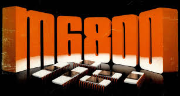

.. _home page:

.. Motorola MC6800 Family Product Catalogue documentation master file, created by
   sphinx-quickstart on Wed Apr  2 16:24:10 2025.
   You can adapt this file completely to your liking, but it should at least
   contain the root `toctree` directive.

Motorola MC6800 Family Product Catalogue documentation
======================================================

The Motorola 6800  (P/N 156-0426-00,156-0426-04,156-2413-00,156-5472-01) is an 8-bit microprocessor monolithic integrated circuit family introduced in 1974.
The original 6800 requires a +5 V supply only (generating bias voltages on chip) and came initially in 40-pin DIL packages. The 6800 has non-multiplexed data (8 bit) and address (16 bit) buses, and requires an external non-overlapping two-phase 0.1 − 1 MHz clock (later versions from 1976 on up to 2 MHz).

The 6802, introduced in 1977, includes 128 bytes RAM and an internal clock oscillator. The 6808 is the same without RAM.

The 68HC11, introduced in 1984, is an upward-compatible microcontroller that adds a second index register, 8x8 multiply and 16/16 divide instructions, as well as a range of 16-bit instructions that treat A and B as a combined 16-bit accumulator. On-chip peripherals include timers, parallel ports, A/D, SPI and UART.
This is a catalogue of the items produced by Motorola in the MC6800 Range of CPUs and their derivatives, support chips and tooling.

.. Important:: 
   The 6805 CMOS family, which includes the MC146805, is neither source- nor object-code compatible with the MC6800 but very similar.
   As such, it is considered a derivative of the 6800 family, not part of it, since it cannot run assembled 6800 code. None of the ICs within this family are in the scope of this collection.

.. Important:: 
   2nd source manufacturers (e.g. Hitachi, NEC, Advanced Micros etc.) are not specifically included in this collection unless an item of hardware is not easily available in its native Motorola implementation.

Scope
=====

It would be an enormous, but not impossible task to list all the Motorola products which are related to ALL of the families described above. However, the scope of this effort (and the physical collection) can be understood on the :ref:`scope page` page.

Collection
==========

There are items in the collection which are detailed here which increase over time. The collection can be found on the :ref:`collection page`.

Conventions Used
================ 

.. csv-table:: 
   :header: "Symbol","Description"
   :widths: 14, 86
   :width: 100

   ":material-regular:`verified;2em;sd-text-success`","This item is present in the collection."
   ":material-regular:`thumb_down;2em;sd-text-danger`","This item has not yet been acquired for the collection."
   ":material-regular:`lock_open;2em;sd-text-danger`","Usually datasheets, this is preliminary or advance information and will be subject to change."
   ":material-regular:`lock;2em;sd-text-success`","This is published material relating to the product as sold."
   ":octicon:`list-ordered;2em`","A second-source item."
   ":material-regular:`local_shipping;2em`","An item in transit"

.. toctree::
   :hidden:

   Home <self>
   Collection <collection>

.. toctree::
   :titlesonly:
   :maxdepth: 1
   :hidden:

   Documents/ApplicationNotes/index
   Documents/Datasheets/index
   Documents/EngineeringNotes/index
   Documents/Generic/index
   Documents/Reference/index
   Documents/Manuals/index

   Documents/ReferenceCards/index
   Documents/Hardware/EXORciser/index
   Documents/Hardware/ICs/index
   Documents/Hardware/Other/index
   Software/index
   ForSale/index

